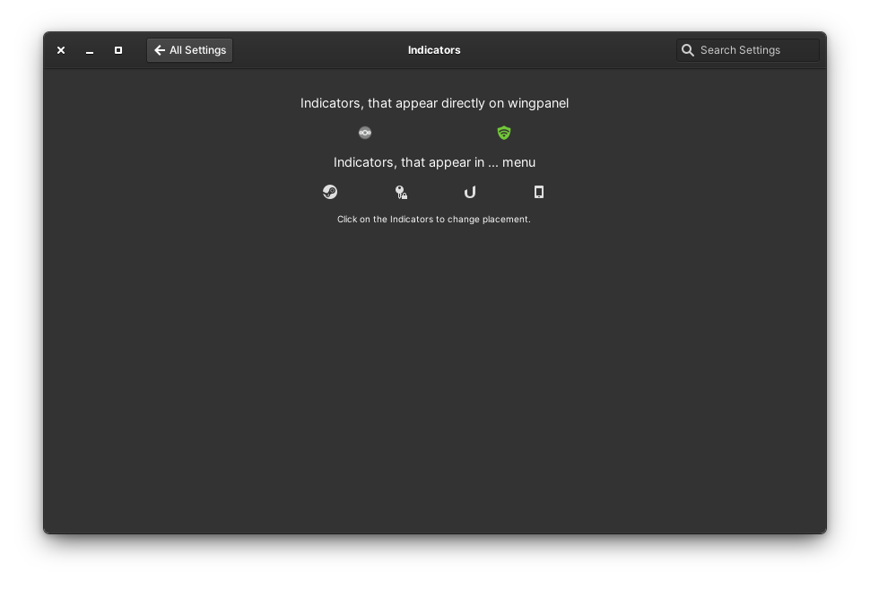

# This will become a Switchboard Plug for the Community Indictors Project.

 

<h1>Description:</h1>
This is a switchboard plug for elementary switchboard, that lets you change settings for <a href="https://github.com/MvBonin/wingpanel-community-indicators">wingpanel-community-indicators</a>.

It is still work in progress but some stuff works (if not yet so pretty).

<h2>Dependencies:</h2>
<pre>sudo apt-get install valac gcc meson libappstream-dev libjson-glib-dev libswitchboard-2.0-dev</pre/>

<h2>Build with meson</h2>
Open a Terminal in the extracted folder, build your application with meson and install it with ninja: 

<pre>meson build --prefix=/usr
cd build
ninja
sudo ninja install
</pre>

<h2>Uninstall</h2>
Open a terminal in the build folder.
<pre>sudo ninja uninstall</pre>
